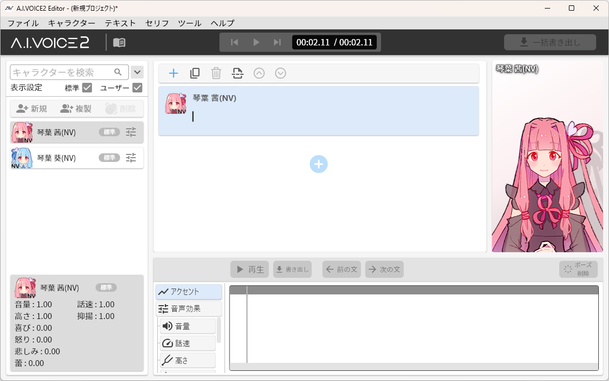

# yukarinette-aivoice2
ゆかりねっととA.I.VOICE2を連携します

## インストール
ゆかりねっとのPluginフォルダにdllとYarukizero.Net.AiVoice2フォルダを格納してください。  
別途.NET 8デスクトップランタイムをインストールしてください。

## 使い方
あらかじめA.I.VOICE2 Editorを起動してゆかりねっとでしゃべりたいキャラクターと音声効果などのパラメータを設定してください。そのエディタ上にゆかりねっとから操作を行います。ゆかりねっと使用中はA.I.VOICE2を操作しないでください。

[voicepeak-connect](https://github.com/azumyar/voicepeak-connect)と異なりA.I.VOICE2 Editorの画面はウインドウの下に隠れていても問題ありません。